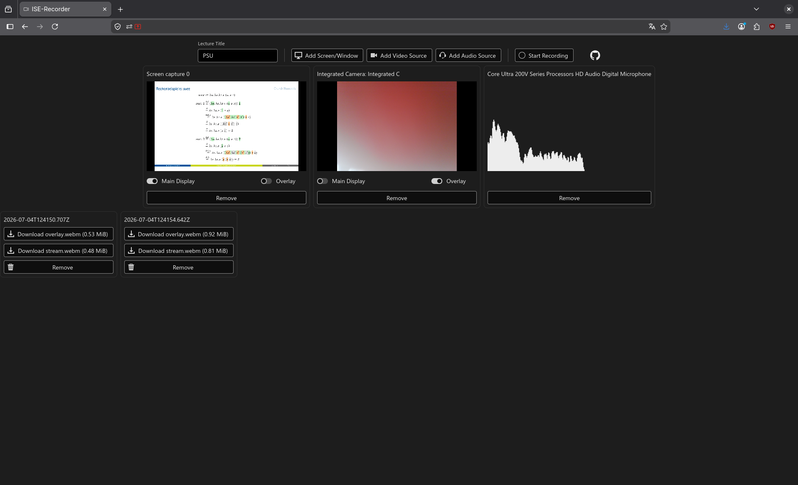

# ISE-Recorder

This is a fairly simple web-based lecture recorder. Its job is to capture your
slides, capture your webcam, and optionally postprocess them such that the
speaker is overlaid over the slide stream in a sensible manner.

Recordings are stored on the client-side in the browser's OPFS and optionally
streamed to a post-processing backend server. If post-processing is enabled,
the recorded streams will be posted to the backend chunk by chunk, followed by
a notification to start post-processing when the recording stops. The backend
can authenticate users against an OpenID Connect service or run without
authentication. The latter is only advisable in small private-network deployments
where everyone in the network is trusted, of course. You don't want the whole
Internet to be able to write to your server and schedule compute-heavy jobs. You
know how those guys are.

Video streams can be marked as main or overlay, and post-processing consists of
overlaying the overlay stream (usually the speaker on a webcam) over the main
stream (usually lecture slides) in the top-right corner such that the slides
are not obstructed but the speaker remains recognizable. If there are multiple
audio streams, they will all be attached to the resulting video file. If there
is no overlay, post-processing just indexes the main video stream.

If there are additional screen or video streams, they will be streamed to the
backend but not used in post-processing. It's then possible to process them
manually. If there is no stream marked as main display, post-processing will
not occur.

## Take a look

## Get started

I recommend running in docker:

    mkdir -m 777 data
    docker compose build
    docker compose up

then visit http://localhost:3000.

The stock `compose.yml` includes a backend that mounts the `data` directory to
its dumping ground, so postprocessed recordings will appear there. The `data`
dir only needs mode 777 if the user configured in the `compose.yml` differs
from the one running in the backend container, which can happen with
rootless docker or if your uid:gid is not `1000:1000`. Giving it mode 777
just avoids the need for configuration before getting started.

For production environments, it's advisable to mount a data directory owned by
the process user in the backend container. You can run it behind a reverse
proxy that handles TLS. I haven't tested serving it in a subdirectory, so I
recommend using a subdomain; the most straightforward config is to have the
frontend at `/` and the backend (if you want one) at `/api`.

In most production environments it's also strongly advised to configure
OpenID-Connect authentication. See `compose-with-auth.yml` for a toy example.

## Configuration

Configuration happens through environment variables. Example values for all of
them are shown in `compose.yml`, and `compose-with-auth.yml` contains an
example deployment with a toy keycloak openid provider.

### Frontend

Frontend configuration consists mostly of pointing it at a post-processing
backend and an openid provider for authentication. It has the following
variables for settings;

| Variable | Example | Meaning |
| - | - | - |
| `ISE_RECORD_API_URL`           | `https://record.example.edu/api`      | Base URL of the post-processing backend API |
| `ISE_RECORD_OIDC_PROVIDER_URL` | `https://auth.example.edu/realms/ise` | URL of the OpenID Connect provider, same as in the backend. |
| `ISE_RECORD_OIDC_CLIENT_ID`    | `ise-recorder`                        | Client-ID as configured in the OIDC provider |
| `ISE_RECORD_OIDC_MAX_AGE`      | `79200`                               | OIDC max_age in seconds |
| `ISE_RECORD_SHOW_VERSION`      | `true`                                | Show a version indicator on the main page |

Sessions past `ISE_RECORD_OIDC_MAX_AGE` will be considered stale, i.e.
ise-recorder will not assume that there is enough time left before its expiry
to record a full lecture. My recommendation is to configure the OpenID client
with long session lengths and max_age - something like 8-day sessions and
7-day max_age - but that'll depend on your security needs, paranoia level, and
how often you want to be forced to enter your password again.

### Backend

The backend configuration splits into broadly three categories: General
operation, reporting, and authentication.

General operation options concern where and how video files are stored and
cross-origin resource sharing. If reporting is configured, the system will send
a report e-mail to the lecturer after post-processing has concluded. For this
to work, the backend needs an SMTP relay in its config. Finally, authentication
is the flip side to the frontend authentication. If the backend is to require
authentication, an OpenID provider and audience must be configured that match
the frontend configuration.

The backend has the following configuration envvars:

| Variable | Example | Purpose |
| - | - | - |
| `ISE_RECORD_ROUTE_PREFIX`               | `/foo`                                      | Route prefix where the API endpoints will be mounted. If set, the prefix must be included in the frontend's `ISE_RECORD_API_URL`. |
| `ISE_RECORD_DESTDIR`                    | `/app/data`                                 | Base directory where the uploaded chunks and processed video files will be stored |
| `ISE_RECORD_CHUNK_FILE_DIGITS`          | `4`                                         | Length of the numerical suffix on uploaded chunks. 4 is default and enough for about 14 hours of recording. |
| `ISE_RECORD_CORS_ORIGINS`               | `[ "https://record-ui.example.edu" ]`       | If the backend is served on a different domain than the frontend, list the frontend's base URL here. |
| `ISE_RECORD_SMTP_SERVER`                | `mail.example.edu`                          | Hostname or IP address of the SMTP relay|
| `ISE_RECORD_SMTP_PORT`                  | `25`                                        | Port to use. Defaults to 587 if `ISE_RECORD_SMTP_STARTTLS` is true, 25 otherwise. |
| `ISE_RECORD_SMTP_LOCAL_HOSTNAME`        | `record-api.example.edu`                    | Hostname of the backend server, used for HELO/EHLO |
| `ISE_RECORD_SMTP_USERNAME`              | `user1`                                     | username for SMTP login, if required |
| `ISE_RECORD_SMTP_PASSWORD`              | `hunter2`                                   | password for SMTP login, if required |
| `ISE_RECORD_SMTP_SENDER`                | `ise-record@example.edu`                    | Mail address to put in the "From" header |
| `ISE_RECORD_SMTP_STARTTLS`              | `true`                                      | Whether `ISE_RECORD_SMTP_SERVER` supports the `STARTTLS` command |
| `ISE_RECORD_SMTP_ALLOWED_DOMAINS`       | `[ "example.edu", "example.org" ]`          | Domains that the backend will send mail to. Subdomains are implicitly whitelisted. |
| `ISE_RECORD_OIDC_PROVIDER_URL`          | `http://keycloak.localhost:8080/realms/ise` | URL of the OpenID authentication provider. Same as in the frontend. |
| `ISE_RECORD_OIDC_AUDIENCE`              | `ise-recorder-api`                          | Audience name that the OpenID provider calls ise-recorder |
| `ISE_RECORD_OIDC_LEEWAY_SECONDS`        | `30`                                        | Allowable clock skew between frontend and backend, used in the expiration check for access tokens |
| `ISE_RECORD_OIDC_HTTP_TIMEOUT_SECONDS`  | `5`                                         | Timeout for OpenID discovery |

## Hack it yourself

Clone repo and for the frontend run

    cd frontend
    npm install
    npm run dev
    # or if you want to use the postprocessing backend:
    ISE_RECORD_API_URL=http://localhost:8000 npm run dev

For the backend run

    cd backend
    python -m venv .venv
    . .venv/bin/activate
    pip install -e . --group dev
    fastapi dev

Both of these accept a number of environment variables for configuration. They
are listed in `compose.yml`.
