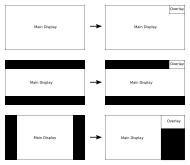
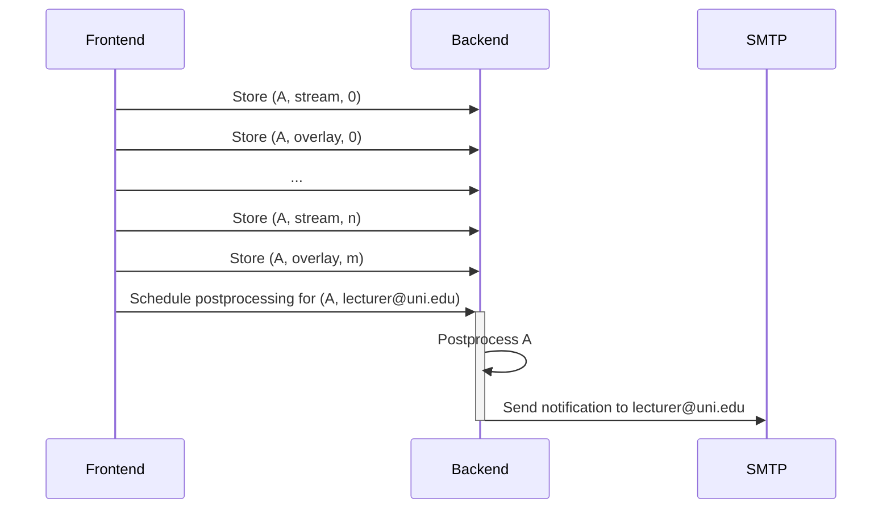

# ISE-Recorder Backend: Technical Documentation

## Purpose

The ISE-Recorder backend combines the tracks recorded by the frontend into one video file such that the main
display (slides) and overlay (speaker video) are arranged in a sensible manner, i.e. such that the speaker is
visible but does not obscure the content on the slides. This may involve cropping of black bars from the slide
stream and rearrangement depending on the format of the slides; the following figure shows the way this backend
treats the main cases:



Note that there is some technical nuance to the positioning of the main display stream: the positioning depends
on the relation between the main display stream's content area after cropping and the output geometry, which we
pick from a pre-defined list (at time of writing 1280x720, 1280x800, 1920x1080). If the recorded screen does not
match the aspect ratio of the output geometry (i.e., captured from a 4:3 device, embedded in 16:9), it will be
positioned as if it had been embedded in a surrounding screen matching the output geometry's aspect ratio (in
this example, matching case 3 of the figure).

The normal, expected case is one main display, one overlay, and one audio stream, where the main display and audio
stream arrive combined as "stream" track from the frontend (see the technical documentation there). In addition
to this, the backend explicitly supports recordings without a video overlay and recordings with multiple audio
tracks. All other inputs are handled in a best-effort manner but considered out of scope for this design spec.

## Workflow

The postprocessing backend of ISE-Recorder is built to accept media streams from the ISE-Recorder frontend
and postprocessing jobs after the streams have ended. The operation is sketched in the following sequence
diagram, which shows the frontend streaming a recording A of two tracks (stream and overlay) of n and m
chunks, respectively, to the backend before scheduling a postprocessing job for recording A with the request
to notify lecturer@uni.edu when postprocessing is complete. Afterwards, the processed recording is available
on the server's filesystem.



The tracks need not have the same number of chunks because browsers can't force the length of media chunks
precisely, so the number of chunks per stream will drift slightly over time. 

## API

The API is an HTTP API with three endpoints:

| Endpoint | Method | Purpose | Parameters |
| - | - | - | - |
| `/api/chunks` | POST | Stream chunks of a media stream | recording name, track name, chunk index, chunk data |
| `/api/jobs` | POST | Schedule postprocessing job | recording name, notification email address |
| `/api/health` | GET | Monitoring | none |

For convenience of implementation on the frontend side, `/api/chunks` accepts input encoded as `multipart/form-data` with the
following fields:

- `recording`: name of recording (string)
- `track`: name of the track (string)
- `index`: number of the chunk in the track (integer)
- `chunk`: chunk data (file)

This is meant to work with the following Typescript snippet:

```typescript
const data = new FormData();
data.append("recording", "GVS_2026-01-23T123456.789Z");
data.append("track", "stream");
data.append("index", "0");
data.append("chunk", chunk); // where chunk is of type Blob

const request: RequestInit = {
    method: "POST",
    body: data
};
```

The `/api/jobs` endpoint accepts a JSON object (with `Content-Type: application/json`) in the body shaped like

```json
{
    "recording": "GVS_2026-01-23T123456.789Z",
    "recipient": "lecturer@uni.edu"
}
```

Where `recording` must match a recording name for which chunks have been stored before.

The `/api/health` endpoint returns HTTP status 200 and `{ "status": "healthy" }` as long as the server is running; it
is useful for primitive monitoring such as docker health checks.

## Where to find what

| File | Purpose |
| - | - |
| `src/ise_record/auth.py` | OpenID-Connect authentication (discovery and token verification) |
| `src/ise_record/logconfig.py` | Logging configuration (e.g., filtering out health checks from the log) |
| `src/ise_record/postprocess.py` | Postprocessing logic |
| `src/ise_record/reporting.py` | Notification sending |
| `src/ise_record/server.py` | API definition |
| `src/ise_record/settings.py` | Configurable server settings |
| `src/rerender.py` | Command-line script to redo postprocessing for a recording |

## Postprocessing Logic

This backend uses ffmpeg command-line utilities for postprocessing. The process has the following phases:

1. Assemble track-wise video/audio files from the stored chunks so that ffmpeg can process them
    - these are treated as temporaries and removed in the end
    - the stored chunks are kept, so they can be recreated at will
2. Analyze the main display stream with ffprobe to figure out
    - the stream's dimensions
    - whether the stream has black bars that need cropping
    - if it does need cropping, what the actual content area is
3. Generate an ffmpeg filter to generate the desired output
    - pick an output geometry that can accommodate the content area of the main display stream
    - crop the main display stream (if necessary)
    - scale the main display stream to match the output geometry
    - position the main display stream as illustrated above
        - in case of vertical black bars, position left
        - in case of horizontal black bars, position vertically centered
    - if there is an overlay stream, scale it to match the unused area and position in the top right
        - scale to match the width of the right black bar in case the main display was positioned left
        - scale to match the height of the top black bar in case the main display was vertically centered
        - in either case, use at least 10% of the output width and height so the speaker remains visible
4. Identify all input files, i.e. stream, overlay, additional audio tracks
5. Combine all those into an ffmpeg command and run it in the background
6. Clean up when finished

## Authentication

The backend supports optional OpenID-Connect-based authentication. In this mode, the backend expects an
`Authorization: Bearer $token` header with an access token with every query, which it validates locally
without per-request calls to the OIDC provider. At server start, it attempts to discover the OIDC provider's
issuer and jwks endpoint, then feeds those to a PyJWT `PyJWKClient`, which handles the key retrieval and
refreshes. The actual token validation and decoding is then also based on PyJWT.

At the moment, the backend does not attempt to distinguish between access and id tokens other than
checking the audience claim against the configured value, i.e. the header is not inspected for
`"typ": "at+jwt"`. This will change in the future, when all common OIDC providers mint their tokens with
that type. Note that there exist OIDC providers where the audience check is unreliable, in particular
kanidm, which forces client id and audience to the same value. They do set `"typ": "at+jwt"`, and that will
ultimately be the test. For the moment, though, I don't have a reliable way to tell apart id and access
tokens from all OIDC providers out there, and as far as I can make out, relying on the audience field
seems to be the standard workaround. So I'm doing that for now.

The access tokens are used to establish trust, i.e. that a request is allowed to store data and schedule
jobs. There are no custom scopes, right now it's all-or-nothing when it comes to permissions. If
`preferred_username` is present in the token, the backend uses `sub` and `preferred_username` to
derive a human-readable (but unique) user-specific directory to store recordings; if it is not present,
it will attempt to read the username from the OIDC provider's userinfo_endpoint. In the future, it may
also read the `email` claim for reporting purposes.
