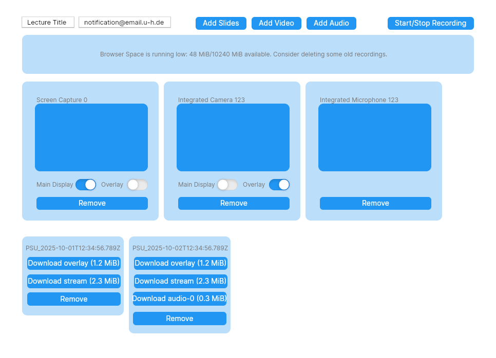
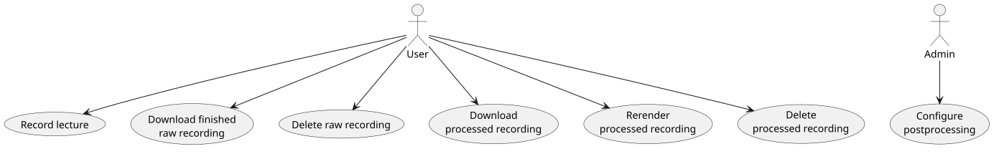
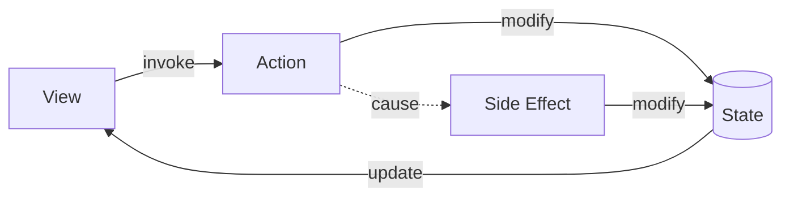
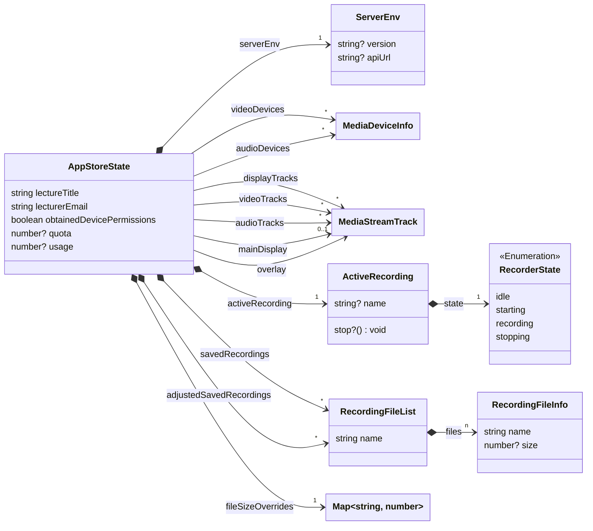
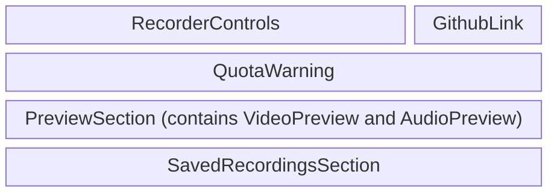
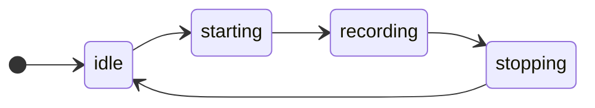

# ISE-Recorder Frontend: Technical Documentation

## UI sketch

## Use Cases

<!--
@startuml use-cases

:User:
:Admin:

User --_> (Record lecture)
User --_> (Download finished\nrecording)
User --_> (Delete recording)
Admin --_> (Configure\npostprocessing)

@enduml
-->

### UC1: Record Lecture

1. User inputs lecture title and postprocessing-completion notification email
    - Alternative: Title and email are remembered from previous use
    - Alternative: No postprocessing backend is configured, notification email input field is not shown
2. User adds the slide stream
    - User clicks the "Add Slides" button
    - The system shows a dialog in which the user can select a window or screen to capture.
    - User selects an input source
    - The system shows a preview for the selected stream. If no main display is selected yet, the stream is selected as main display.
3. User adds the overlay stream
    - User clicks either "Add Video" or "Add Audio"
    - Browser asks permission to access media devices. This allows selecting a camera and microphone.
    - Both the selected camera and microphone are added as streams and shown as previews. If no overlay is selected yet, the camera stream is selected as overlay.
4. User adds another microphone
    - User clicks "Add Audio"
    - System shows a drop down menu listing the available microphones
    - User selects the desired microphone
    - System shows the stream from the microphone alongside the other previews (as audio spectrum)
5. User records a lecture
    - User clicks "Start Recording"
    - System relabels the "Start Recording" button to "Stop Recording"
    - System disables lecture title, notification email input boxes, add slides/video/audio buttons, main/overlay selection toggles, and remove buttons under previews
    - System shows a new recording with disabled download/remove buttons that has files "stream.webm", "overlay.webm", and "audio-0.webm" with size 0
    - While the user lectures, system shows the new recording in the saved-recordings section with disabled download and remove buttons. Size estimates are updated frequently. Media are streamed to postprocessing backend.
    - Browser space runs low, quota warning is shown.
    - User clicks on the "remove" button of an old recording.
    - System cleans up the old recording and removes the deleted recording and quota warning from the UI.
    - User clicks "Stop Recording"
    - System relabels "Stop Recording" to "Start Recording", re-enables controls, enables the Download and Remove buttons on the new recording, and schedules a postprocessing job for the new recording with the backend.

### UC2: Download recording

- System displays a list of recordings under the main UI
- User clicks "Download" button on the first recording
- System starts a download of the corresponding file

### UC3: Delete recording

- System displays quota warning a list of recordings under the main UI
- User clicks "Remove" button on a recording
- System cleans up the space and removes the recording and quota warning from the UI

### UC4: Configure postprocessing backend

- Admin sets `ISE_RECORD_API_URL` environment variable to the backend endpoint URL during deployment
- System shows the notification email address input field, streams to postprocessing and schedules postprocessing jobs upon completion
- Alternative: Admin leaves `ISE_RECORD_API_URL` empty. Notification email address input field is not shown, streaming not attempted, and postprocessing not scheduled.

## Architecture

The ISE-Recorder frontend is organized in a (somewhat simplified) flux/redux-style architecture:

- The UI state is organized in one central state object (implemented with the popular [Zustand](https://github.com/pmndrs/zustand) library)
- Views display information from the State and allow the user to invoke actions
- Actions modify the application State and cause asynchronous side effects
- Modifications of the State cause views to be rerendered
- Side Effects (e.g. storage of recorded media chunks) can modify the State even when the user is not taking actions, e.g. to update the UI during recording.

The above figure illustrates the core UI loop. The State mediates which parts of the UI need to react. Views make their interest
in a specific part of the State known through the use of hooks and are rerendered when that part of the state changes.

## Where to find what

The application is built on Next.JS's app router, and the project organization follows from that. All application code is in the
folder `app`, the tests in folder `__tests__`.

There are four main subsystems in the application code:

| Subsystem | Function | Path |
| - | - | - |
| The Application Store | State management | `app/lib/store` |
| Views | Display and user interaction | `app`, `app/lib/components` |
| Hooks | State access and action logic | `app/lib/hooks` |
| Utility functions | Application logic not concerned with UI updates | `app/lib/utils` |

## Application State (Store)

The application state acts as a single source of truth for all components hooked into it. It is illustrated in the following
class diagram:

The state broadly covers the following tasks:

| State component | Content/Purpose |
| - | - |
| `serverEnv` | URL of the postprocessing backend server (if any), version number for display (if configured) |
| `lectureTitle` | used to name recordings |
| `lecturerEmail` | to send a notification after postprocessing |
| `obtainedDevicePermissions` | whether the app has previously obtained permission from the browser to enumerate (and capture) media devices |
| `videoDevices`, `audioDevices` | list of media devices. Displayed during media source selection and used to capture video and audio tracks |
| `displayTracks`, `videoTracks`, `audioTracks` | Lists of display capture, camera, and microphone tracks added by the user. Displayed as previews, captured during recording |
| `mainDisplay`, `overlay` | Tracks selected as main display and overlay (if any). Used to determine recording track names and set roles for postprocessing |
| `activeRecording` | whether the app is currently recording, what the name of the recording is, and a `stop` function to finish the recording if one is active  |
| `fileSizeOverrides` | amount of data recorded in the active recording, which is not yet committed to the browser OPFS and so doesn't appear in `savedRecordings` |
| `savedRecordings` | list of finished recordings as present in the OPFS, i.e. without adjustments from `fileSizeOverrides` |
| `adjustedSavedRecordings` | `savedRecordings` with adjustments from `fileSizeOverrides`. Displayed in the UI. |
| `usage`, `quota` | displayed in the quota warning, and determines if that warning is shown |

The state is modified through a number of supplied mutation functions that guarantee state consistency. In particular:

- a change to `fileSizeOverrides` or `savedRecordings` is reflected in `adjustedSavedRecordings`
- event handlers are attached to tracks saved in the state that remove the tracks from the state in response to their `ended` events.
- `mainDisplay` and `overlay` are reset if the track they refer to is removed

## Views

At present, ISE-Recorder is a single-page application. The UI is split into the following components:

| View | Function |
| - | - |
| `RecorderControls` | Top-of-page recording controls: Buttons to add streams, start/stop recording, input fields to configure lecture title and notification email |
| `GithubLink` | Link to this project's github page |
| `QuotaWarning` | Shown when in-browser space for recordings runs low |
| `PreviewSection` | Shows configured tracks to the user; user can configure main and overlay tracks or remove unwanted tracks |
| `VideoPreview` | Preview of a configured video or screen capture stream, with controls to select main and overlay streams |
| `AudioPreview` | Displays the spectrum of the captured audio stream, so the user can easily identify whether the captured device is actually capturing sound. |
| `SavedRecordingsSection` | Shows the list of finished recordings; recordings can be downloaded or deleted |

Views are exclusively focused on displaying data and triggering actions. Both the displayed data and the trigger action functions
are obtained from hooks, so the views themselves are quite thin.

## Hooks

The hooks manage access to the store. They organize the application store into views by filtering out the relevant
parts for their topic, and provide action functions that cause updates to the store and side effects (such as recording).
The semantics here follow standard React/Zustand hook patterns, their purpose it effectively what a middleware or thunks would
achieve in a pure redux architecture.

The hooks themselves are meant to contain only the UI-specific logic. What precisely this means in a frontend
is of course a bit of a judgement call, but the heavier application logic lifting is done in utility functions, which the hooks
use. For example, the start-recording action provided by the `useActiveRecording` hook uses the recording utility function and
provides it with a number of callback functions that specify how the UI is to be updated when certain events during recording
occur, e.g. the size of the active recording is updated as chunks of data roll in. Thus the actual recording logic is cleanly
separated from UI updates, and that's largely the purpose of the hook/utility split.

| Hook | Purpose |
| - | - |
| `useActiveRecording` | action functions to start and stop recording |
| `useBrowserStorage` | provides information about the browser's OPFS, i.e. saved recordings and quota information, and an action to delete a recording |
| `useLecture` | provides the configured lecture title and notification email address |
| `useMediaDevices` | provides the list of audio and video devices and actions to refresh that list and open media tracks from a device |
| `useMediaTracks` | provides the list of open tracks, which of those are selected as main and overlay, and actions to select main and overlay track or close a track. These actions will only work when the application is not recording. |
| `useServerEnv` | provides the server-side configuration (no actions) |

## Utilities

The Utilities contain the application logic beyond UI updates and free UI functions that don't touch the application store. These
fall into the following subsystems:

| Utility | Purpose |
| - | - |
| `browserStorage` | save, query, delete, and download recordings in the browser-local file system |
| `notification` | show warning and error messages to the user |
| `recording` | recording logic; determines recording ID and track names, starts recording the configured tracks, stores the recording in the browser and optionally streams it to a backend server, where it also optionally schedules postprocessing when the recording ends. |
| `serverEnv` | Definition, validation and wiring of the server environment into the nextjs framework |
| `serverStorage` | functions to stream chunks of media to the backend server (if configured in the server env) |

The `recording` utility is the heart of the application logic and the most complex piece of machinery in the project, so read the comments
there when you're working on it. There is some complexity here wrt ensuring that chunks of media are not dropped, processed in the
right order, and not dropped from streams to the backend even if the server becomes momentarily unavailable (e.g. is restarted). Some
of the lessons captured in that code were learned the hard way, so if you read that code and think "well, this seems needlessly complicated,
and the comment above it is TL;DR", there's approximately a 100.2% chance that comment clarifies which corner cases require the complexity.

## Recording logic

### Track handling

The standard case of a recorded lecture consists of one display track (slides, marked as main display), one camera track (speaker video,
marked as overlay), and one audio track (speaker audio), and this is the case ISE-Recorder is really built for. Other scenarios are
supported but will often require manual handling of multiple stream files. This is in part due to browser limitations and in part due
to the fact that the user's intent is not easily inferrable in the general case. More on that below.

In the normal case, the main display (slides) stream and audio stream are recorded together as `stream.webm`, and the overlay
(speaker video) is recorded separately as `overlay.webm`. The reasoning behind this is that a slide stream with speaker audio is
the most useful partial recording. If a postprocessing backend is configured, it will combine these streams by rendering the
overlay (speaker video) in the top right corner of the slide stream, small enough to not obstruct important information on normal
slide decks.

If streams are missing (most commonly the speaker video), the other streams will still be recorded. Additional streams -- a second
slide deck, multiple angles of speaker video, multiple microphones -- can be recorded and will show up as individual files in the
finished recording, named `display-0.webm`, `display-1.webm`, `video-0.webm`, `audio-0.webm`, etc. The postprocessing backend will
incorporate additional audio streams, but additional video streams require manual handling. In the frontend, additional audio streams
will always show up as individual files, largely because at time of writing browsers don't yet support recording multiple audio
streams in one file.

### Technical Implementation

On a technical level, the main challenge is to not drop any media chunks and stream them in the correct order to the browser-local
OPFS and (optionally) the post-processing backend. Media chunks are pushed to us by an event handler, and the storage operations
are asynchronous in both cases, so the store operations either need to be able to run in parallel for different chunks, or we need
to sequence them explicitly.

For the postprocessing backend, we send the chunk number alongside the chunk and store them in different files on the server. This
way, several chunks can be uploaded in parallel. For the browser-local OPFS, streams are stored in a single file, and so the store
operations need proper sequencing. The implementation achieves this by not storing chunks immediately in the OPFS as they arrive,
since at that point a previous store operation could still be in flight, but instead append them to a queue that is polled by a background
coroutine. The precise mechanism is documented in a code comment.

### UI updates

While a recording is underway, the UI state needs to be managed to

- prevent the user from putting the application into undefined states, e.g. adding/removing tracks during a recording, or starting
  a recording while one is already underway
- update the so-far recorded size of the active recording

This is done in a way that cleanly separates recording and UI logic. To this end, we define the following recorder states:

Of the, "starting" and "stopping" are transient and usually only active for a fraction of a second, although a slow-responding
postprocessing backend can keep the UI in the "stopping" state for longer in exceptional cases. The "starting" state is mostly there
to prevent double-starts of recordings in response to double-clicks by the user.

The mechanism for UI updates during recording are four callback functions, passed from the `useActiveRecording` hook into the
recording utility function and called at state transitions or in response to arriving media chunks.

- At the idle -> starting transition, large parts of the UI are disabled and the `beforeunload` event arrested to prevent accidental
  closing of the application during an active recording. The "Start Recording" button is relabeled "Stop Recording" and disabled.
- At the starting -> recording transition, the "Stop Recording button" is re-enabled and the new recording first shown in the
  list of recordings (with disabled download/remove buttons and size 0)
- in response to media chunks arriving, the file sizes of the new recording are updated
- At the recording -> stopping transition, the icon in the "Stop Recording" button is replaced by a progress spinner to signal to the
  user that the app is waiting for background processes (streaming to backend and scheduling postprocessing) to finish
- At the stopping -> idle transition, the UI is re-enabled, the "Stop Recording" button relabeled "Start Recording", the `beforeunload`
  event reset to default behavior, the now finished recording has its buttons enabled, and its file size information is read
  from the OPFS instead of the file size override map (which is reset).
